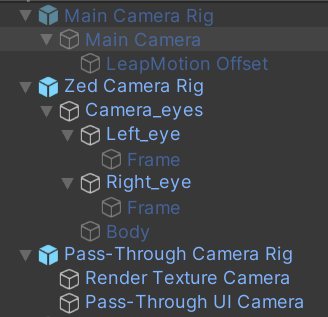

# <span style="color: rgb(0, 255, 205);">**GradualReality**</span>


**Authors**: [Hyuna Seo](https://hyunaseo.github.io), Juheon Yi, Rajesh Balan, Youngki Lee 

**Publication**: ACM UIST, Oct 2024

**Paper**: [GradualReality: Enhancing Physical Object Interaction in Virtual Reality via Interaction State-Aware Blending](https://doi.org/10.1145/3654777.3676463)

## Research project description
We present **GradualReality** system that enables interaction with physical objects in the immersive virutal environment. Most prior work has relied on the Pass-Through technique, which excessively exposes real-world information in the virtual environment to support interaction. However, this causes an extreme trade-off between usability and immersion, deteriorating the user experience and hindering daily VR usage. To address this issue, we propose an **Interaction State-Aware Blending** approach for GradualReality system, which gradually blends real-world information in the virtual environment based on the current user's interaction context.

## Hardware Requirements
- HTC VIVE PRO 2
- VIVE Tracker 3.0 for object tracking 
- Leap Motion contorller 1 for hand tracking 
- ZED Mini camera for Pass-Through implementation 
- Windows 11 computer with 8 GB RAM or more and NVIDIA GTX 2070 or higher satisfying ZED Mini requirements 

<details>
    <summary>ZED Mini and Leap Motion Setup with HTC Vive Pro 2</summary>
    We have attached the ZED Mini and Leap Motion to the HTC VIVE PRO 2 as shown below.
    <p align="left">
        
    </p>

1. **Zed Mini**
- The ZED Mini should be aligned with the center of the front camera of the HTC VIVE PRO 2.
- Putting it below the HMD's camera is one possible option, but you will need to adjust the zed camera's parameters, which ~~is a disaster~~ can make implementing Pass-Through very difficult (it becomes challenging to accurately apply Pass-Through to the exact position of objects).

2. **Leap Motion controller**
- The Leap Motion is attached below the front camera of the HTC VIVE PRO 2.
- Since the ZED Mini obstructs the front camera, it is not possible to use hand tracking provided by VIVE, Steam, or OpenXR, making the Leap Motion necessary.

</details>

## Installation 
1. Clone this repository. 
```bash
git clone https://github.com/hyunaseo/GradualReality.git
```
2. Create a new Unity project using the 3D Built-in Render Pipeline with Unity Editor version 2021.3.2f1.

3. Install XR Plugin Management through Edit -> Project Settings.

4. In the Package Manager, import VIVE Input Utility 1.19.0 and SteamVR 2.7.3.

5. In Project Settings -> Player -> Other Settings, set (1) Color Space to Gamma and (2) Allow downloads over HTTP to Always Allowed.

6. In Project Settings -> XR Plugin Management, select OpenVR Loader and set Stereo Rendering Mode in OpenVR to Multi Pass.

7. Download and import ZED SDK 3.8.0 from the provided [link](https://www.stereolabs.com/en-kr/developers/release/3.8).

8. Follow the provided [link](https://github.com/ultraleap/UnityPlugin?tab=readme-ov-file#Installation) to install Ultraleap SDK using OpenUPM, then install Ultra Tracking version 6.6.0 from My Registries in the Package Manager.

9. Import GradualReality.unitypackage from the cloned repository into your Unity project.

10. Open `Assets/Scenes/Gradual Reality Main Scene` and play. 

<!-- 
## Code 
This code is structured to execute GradualReality, encompassing the following key tasks:

1. [Initial Settings](#initial-settings) for cameras and hand tracking
2. [GradualReality Settings](#gradualreality-settings) for interaction states and blending methods
3. [Object Settings](#object-settings) for tracker assignment and physical object information -->

## Physical Object Settings

<!-- 
### 1. Set camera rigs
There are three camera rigs for GradualRealtiy. Please add them to the scene as follows. If you need more detailed explanation about the component settings, please refer to [this](./Assets/Prefabs/Camera%20Rigs).
1. `Main Camera Rig` for Virtual Environment: Add `Assets/Prefabs/Camera Rigs/Main Camera Rig` to the scene, and set its rotation as (0, 90, 0). Make sure to set the `Main Camera Rig` and `all its child game objects` to **inactive** in the scene!
2. `Zed Camera Rig` to obtain camera feeds: Add `Assets/Prefabs/Camera Rigs/Zed Camera Rig` to the scene. Set the child objects `Frame` to **inactive** in the scene.
3. `Pass-Through Camera Rig` to obtain render texture for Pass-Through and render it: Add `Assets/Prefabs/Camera Rigs/Pass-Through Camera Rig` to the scene, and set its rotation as (0, 90, 0). 

<details>
    <summary>Camera rigs in the scene</summary>
    <p align="left">
        
    </p>
</details>

### 2. Set hand tracking
1. Add `Assets/Prefabs/Hand Tracking/Hands` to the scene, and set its rotation as (0, 90, 0). 
2. Set `Hands` > `Interaction Manager` and its children game objects' layer as `Hands`. 
3. Find `Hands` > `XR Leap Provider Manager` > `Service Provider (XR)` game objects in the scene. 
- Link main camera: For Leap XR Service Provider component's Main Camera, add `Main Camera Rig` > `Main Camera` game object in the scene. 
- Modify hand tracking offset: Since the Leap Motion is attached below the VR HMD's center, you need to manually apply the hand tracking offset. This can be configured in the Leap XR Service Provider component's  the advanced options as below:
    - Device Offset Mode: Manual Head Offset
    - Temporal Warping Mode: Auto
    - Device Offset Y Axis: -0.08
    - Device Offset Z Axis: 0.12
    - Device Tilt X Axis: 10

### 3. Virtual scene settings 
Add your own virtual scenes and components for your amazing immersive experience!!!!

## GradualReality Settings 
### 1. Set GradualReality prefab
Add `Assets/Prefabs/GradualReality` to the scene, and set its rotation as (0, 90, 0). The `GradualReality` prefab consists of a total of 3 components as below. 
    - `GradualReality Manager`: You can set detailed parameteres of GradualReality from this.
    - `Initialize Camera Rigs`: Since the rendering order changes according to the active status of the camera rigs, you must manually connect the `Zed Camera Rig` and `Main Camera Rig` in the inspector using this script. 
    - (Optional) `Zoom Field Of View`: This resolves issues arising from the different FoVs of the ZED mini and VR HMD. This is not mandatory; for more details, please refer to the comments within the script.


## Object Settings 
### 1. Get tracker serial numbers
To map the tracker of physical object with the virtual proxy, you should know the tracker's serial numbers.  -->