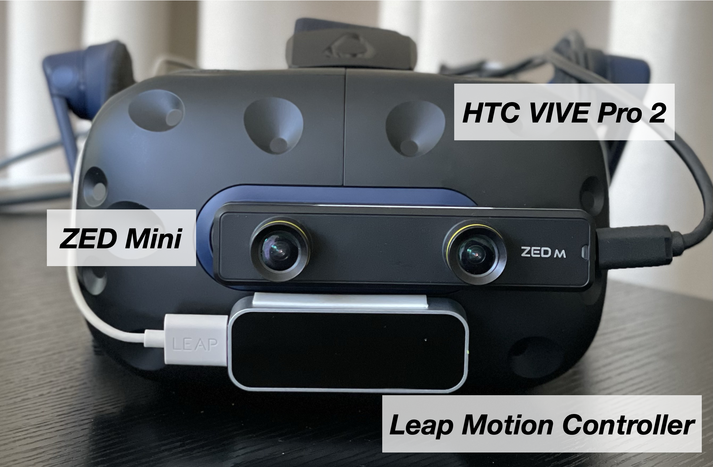

# **GradualReality**

**Authors**: [Hyuna Seo](https://hyunaseo.github.io), Juheon Yi, Rajesh Balan, Youngki Lee 

**Publication**: ACM UIST, Oct 2024

**Paper**: [GradualReality: Enhancing Physical Object Interaction in Virtual Reality via Interaction State-Aware Blending](https://doi.org/10.1145/3654777.3676463)

## Research project description
We present **GradualReality** system that enables interaction with physical objects in the immersive virutal environment. Most prior work has relied on the Pass-Through technique, which excessively exposes real-world information in the virtual environment to support interaction. However, this causes an extreme trade-off between usability and immersion, deteriorating the user experience and hindering daily VR usage. To address this issue, we propose an **Interaction State-Aware Blending** approach for GradualReality system, which gradually blends real-world information in the virtual environment based on the current user's interaction context.

## Main Features 

## Prerequisites 
We implemented this project with Unity 2021.3.2f1. 

### Hardware Requirements
- HTC VIVE PRO 2
- VIVE Tracker 3.0 for object tracking 
- Leap Motion contorller 1 for hand tracking 
- ZED Mini camera for Pass-Through implementation 
- Windows 11 computer with 8 GB RAM or more and NVIDIA GTX 2070 or higher satisfying ZED Mini requirements 

    
ZED Mini and Leap Motion Setup with HTC Vive Pro 2

    We have attached the ZED Mini and Leap Motion to the HTC VIVE PRO 2 as shown below.
    

        
    

1. **Zed Mini**
- The ZED Mini should be aligned with the center of the front camera of the HTC VIVE PRO 2.
- Putting it below the HMD's camera is one possible option, but you will need to adjust the zed camera's parameters, which ~~is a disaster~~ can make implementing Pass-Through very difficult (it becomes challenging to accurately apply Pass-Through to the exact position of objects).

2. **Leap Motion controller**
- The Leap Motion is attached below the front camera of the HTC VIVE PRO 2.
- Since the ZED Mini obstructs the front camera, it is not possible to use hand tracking provided by VIVE, Steam, or OpenXR, making the Leap Motion necessary.

### SDK Requirements
- XR Plugin Management 4.3.1 
- Steam VR Plugin 2.7.3 (sdk 1.14.15)
- VIVE Input Utility 1.17.0
- OpenVR XR Plugin 1.1.4 (Renference [link](https://docs.unity3d.com/Packages/com.unity.xr.management@4.3/manual/index.html).)
- Zed Unity Plugin v3.8.0 (Download from this [link](https://www.stereolabs.com/en-kr/developers/release/3.8).)
- Ultraleap Tracking 6.6.0 (Follow the instructions for setting up OpenUPM from [this link](https://github.com/ultraleap/UnityPlugin?tab=readme-ov-file#Installation).)

## Initial Settings

### 1. Camera rig settings 
There are three camera rigs for GradualRealtiy. Please add them to the scene as follows. If you need more detailed explanation about the component settings, please refer to [this](Assets/Prefabs/Camera Rigs/README.md). 
1. *Main Camera Rig* for Virtual Environment: Add `Assets/Prefabs/Camera Rigs/Main Camera Rig` to the scene, and set its rotation as (0, 90, 0). Make sure to set the *Main Camera Rig* and *all its child game objects* to **inactive** in the scene!
2. *Zed Camera Rig* to obtain camera feeds: Add `Assets/Prefabs/Camera Rigs/Zed Camera Rig` to the scene. Set the child objects *Frame* to **inactive** in the scene.
3. *Pass-Through Camera Rig* to obtain render texture for Pass-Through and render it*: Add `Assets/Prefabs/Camera Rigs/Pass-Through Camera Rig` to the scene, and set its rotation as (0, 90, 0). 